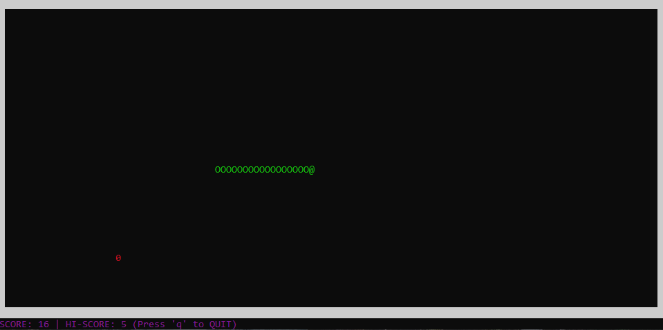

# Snake-C



A classic Snake game built entirely in C that runs directly in your terminal. It uses standard VT100 without relying on external graphics libraries like ncurses.

## Features
* **Raw Terminal Rendering:** Built using direct VT100 escape sequences.
* **Linked List Architecture:** Dynamic snake growth handled entirely through C pointers.
* **Aspect Ratio Compensation:** Chnages window dimesnions according to the terminal size.
* **High Score Tracking:** Keeps track of your best run during the session.
* Might Add some features later :3

## Prerequisites
* A Unix-like terminal (Linux, macOS, or WSL on Windows)
* A C compiler (GCC or Clang)

## How to Play

**1. Compile the game**
Open your terminal in the project directory and run:
```gcc snake.c -o snake```

**2. Run the game**
Once compiled, start the game by running:
```./snake```

## Controls
* **Arrow Keys:** Move Up, Move Left, Move Down, Move Right
* **q:** Quit Game
